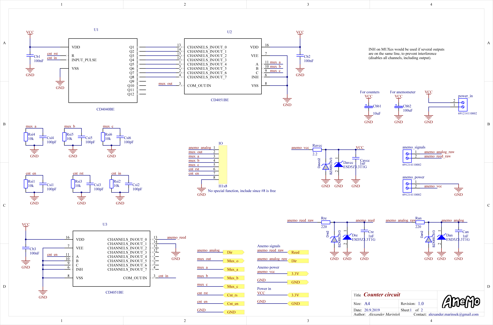
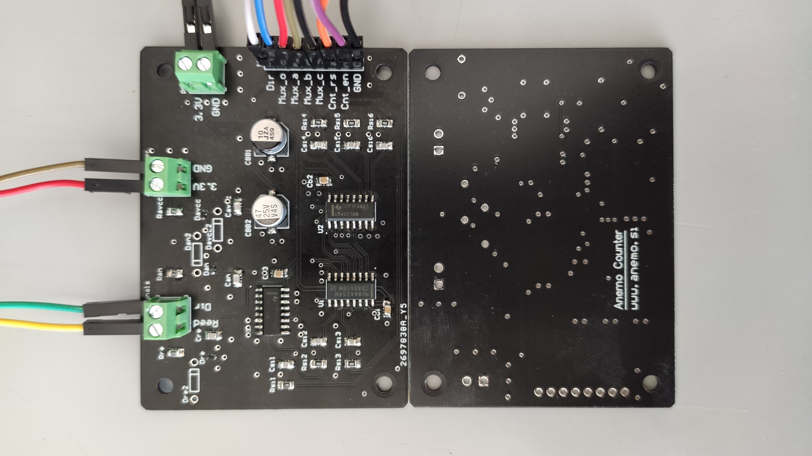

# Anemo Counter circuit

Source PCB design files of the Anemo Counter circuit (ACC), primarily intended for use with cup based anemometers and normally interfaced using a MCU running an instance of the [Anemo embedded application](https://bitbucket.org/AlexanderMarinsek/riot-custom-apps/src/master/).

## Build

Built around one CD4040 ripple carry counter and two CD4051 multiplexers the ACC features a 8 pin header used for interfacing the counter and MUXs, one power input terminal, one power output terminal and a signal input terminal. Its input can be disabled via the input MUX, while the output MUX is in charge of multiplexing the bottom 8 bits to a single output line. By default it includes input ESD protection, long signal line termination and power supply ripple removal. The circuit's consumption is in the region of a few ten micro amps.

## Assembly

Straight forward assembly using basic laboratory, or DIY equipment. 
*Having a magnifying glass and a small soldering iron tip at your disposal makes life easier.* 

## Further reading

More about the ACC and its usage can be found in [my master's thesis](https://www.researchgate.net/profile/Alexander_Marinsek).

